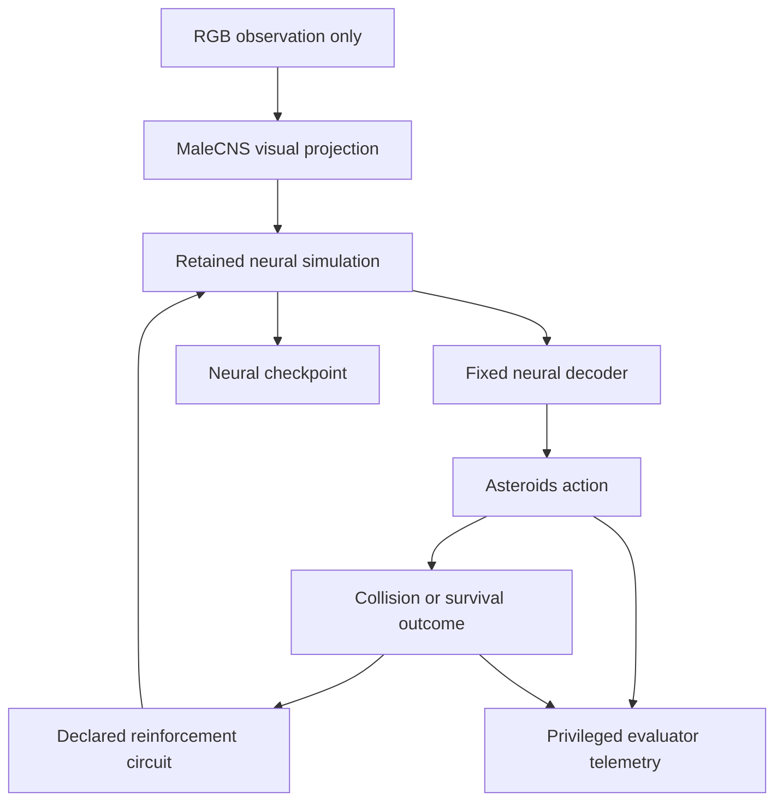

# Whole-connectome Asteroids integration plan

This is the implementation plan written before the game integration. The goal is
to test whether a connectome-constrained simulation can improve spacecraft-style
collision avoidance through repeated pixel-driven play and consequences. It is
not a claim that a biological fly understands Asteroids.

## System boundary

The decoder can receive declared neural activity only. Asteroid coordinates,
velocity, collision prediction, health, score, future geometry and labels are
privileged evaluator data and cannot select actions.

## Milestones

### A. Playable deterministic environment

- Adapt the selected MIT Pygame implementation into an importable environment.
- Use a fixed 1/30-second game step and an environment-owned seedable RNG.
- Expose `NOOP`, `LEFT`, `RIGHT`, `THRUST` and `FIRE`; keep firing disabled in
  the initial survival configuration.
- Keep the neural RGB surface free of HUD text and privileged state.
- Provide keyboard play, off-screen/headless execution, RGB capture, collision,
  health, death, automatic-reset support and structured telemetry.
- Verify identical seeds and actions produce identical frames and telemetry.

Exit gate: a person can play locally, and automated tests verify seeding,
controls, frames, collisions and reset behavior.

### B. Frozen neural baseline

- Reuse the current 3,335 R1-R6 plus 811 R8 pixel transformation without adding
  object-state features.
- Run the complete retained MaleCNS graph for each declared game interval.
- Calibrate a fixed Asteroids decoder separately from evaluation: DNp20
  right-minus-left for rotation, DNpe017 for thrust, low activity for no-op.
- Leave firing disabled. If later enabled, declare and freeze a separate neural
  readout before evaluating learning.
- Record matched fixed-weight baselines, action distributions, collision rate,
  survival, clearance and movement use.

Exit gate: real RGB frames causally affect neural activity and fixed neural
actions in the actual game, with no privileged control path.

### C. Persistent training

- Continue neural and plasticity state across episode resets while resetting only
  game state and episode-local evaluator state.
- Deliver reinforcement only after the outcome that caused it.
- Start by comparing nonfatal-contact pulses with an explicit terminal pulse
  delivered before/across reset. Record timing and actual dose exactly.
- Never rewrite weights directly from game score.
- Save source/model hashes, game seed/action/frame hashes, checkpoint hashes and
  enough telemetry for exact replay.

Exit gate: repeated episodes and reset/checkpoint recovery work, and every
reinforcement event is traceable to a preceding outcome.

### D. Frozen evaluation

- Disable reinforcement and plasticity, load the trained efficacy state and
  evaluate on held-out seeds.
- Compare original fixed weights, trained frozen weights and shuffled/yoked
  reinforcement controls across multiple independent training runs.
- Test retention without reinforcement and, if defensible, loss of benefit after
  a targeted memory intervention.

Exit gate: any learning claim requires repeatable baseline-to-frozen improvement
on held-out seeds plus causal weight and control evidence. Changed weights or a
long training episode are not sufficient.

## Time and performance reporting

Every run must distinguish game time, simulated neural time, wall-clock time,
episode count and frozen-evaluation episodes. The full graph was slower than real
time in the current Doom experiments, so initial Asteroids throughput estimates
must be measured on Rob's 24 GB M5 MacBook rather than inferred from game-only
headless speed.

